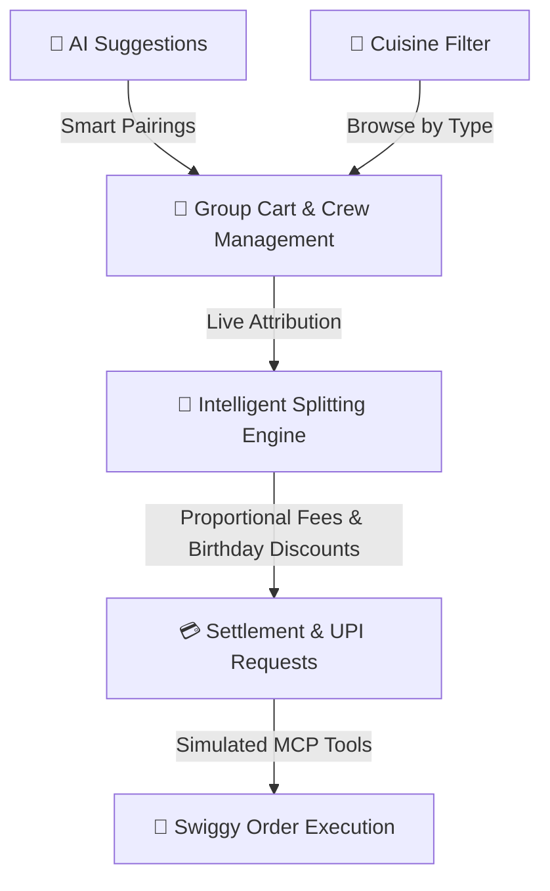

# 🍕 Splitly — Group Food, Sorted.

[](https://mcp.swiggy.com/builders)
[](https://developer.mozilla.org/)
[](#-safety--guardrails)

**Splitly** is an AI-native group ordering and bill-splitting prototype built for students, roommates, and campus crews. Designed as an interactive showcase for the **Swiggy Builders Club**, Splitly eliminates the "awkward math" of group food orders while demonstrating production-grade orchestration across **Swiggy Food**, **Swiggy Instamart**, and **Swiggy Dineout** via the **Model Context Protocol (MCP)**.

---

## ✨ Why Splitly?

Group food ordering on campuses usually involves endless screenshots, manual calculator math, and chasing people for UPI payments. Splitly transforms this into a collaborative, AI-assisted experience:



---

## 🚀 Core Capabilities

### 1. 👥 Collaborative Ordering & Attribution
- **Unified Table Order**: Build an order from *Spice & Slice* with real-time crew tracking.
- **Individual vs. Shared Ownership**: Assign each dish to a specific person or mark it as **Shared Equally** across the table.
- **Dynamic Crew Expansion**: Add friends on the fly with XSS-safe validation and automatic duplicate name resolution.

### 2. 📉 Intelligent & Reconciled Bill Splitting
Splitly supports two distinct settlement modes:
- **Exact Split (Proportional Attribution)**: You pay only for what you eat. Shared platform/delivery fees and host discounts are distributed **proportionally** based on your share of the subtotal.
- **Equal Split**: The total bill (including all fees and savings) is split equally among all crew members.
- **Rupee-Exact Reconciliation**: Uses the **Largest Remainder Method** to ensure individual integer shares sum up exactly to the invoice total without a single rupee of rounding leakage.

### 3. 🎂 Birthday Party Mode
- **Host Reward**: Toggle **Birthday Mode** on the host's birthday to unlock up to **₹150 (20% off)** instant savings.
- **Dynamic Eligibility**: Automatically validates eligibility and reflects clean celebratory UI signaling for the entire group.

### 4. 🍴 Cuisine Filtering & Custom Dishes
- **Cuisine Tabs**: Filter the menu by North Indian, Chinese, Pizza & Snacks, or Drinks & Desserts.
- **Custom Dishes**: Add your own dishes to the menu with a name and price — they appear across all filters.

### 5. 🧠 AI Suggestions
Smart, context-aware recommendations that adapt to what the group has ordered:
- Pairing suggestions (e.g., Mango Lassi with Biryani)
- Budget-aware recommendations when you're running low
- Nudges for unordered crew members
- Dessert prompts after main courses

---

## 🧮 The Exact-Split Mathematical Model

For **Exact Split** mode, each participant's share $S_i$ is calculated as:

$$S_i = C_i + \left( \frac{C_i}{T_{\text{subtotal}}} \times F_{\text{fees}} \right) - \left( \frac{C_i}{T_{\text{subtotal}}} \times D_{\text{discount}} \right)$$

Where:
- $C_i$ = Value of items owned by person $i$ plus their equal portion of shared table items.
- $T_{\text{subtotal}}$ = Total food subtotal across all items.
- $F_{\text{fees}}$ = Delivery & platform fee (₹57).
- $D_{\text{discount}}$ = Birthday reward savings (up to ₹150).

> **Reconciliation Guarantee**: After computing proportional floating-point shares, the **Largest Remainder Algorithm** distributes any leftover fractional rupees to the participants with the highest remainders so $\sum S_i = \text{Total Bill}$.

---

## 🗺️ Swiggy MCP Tool Boundaries

Splitly simulates the exact contract schemas of Swiggy's MCP developer ecosystem:

```
[Splitly Client]
       │
       ├─► get_food_cart()           ──► Validates items, totals & availablePaymentMethods
       ├─► place_food_order()        ──► Submits order with addressId & paymentMethod (ONLINE / COD)
       └─► track_food_order()        ──► Returns live order status & ETA (28-32 min)
```

---

## 🏁 Quickstart Guide for Judges & Reviewers

Splitly is completely dependency-free and runs directly in any modern web browser.

### Option 1: Instant Local Static Server (Recommended)
```bash
# Serve the directory on http://localhost:3000
npx serve .
```

### Option 2: Direct File Open
Simply open `index.html` in Chrome, Firefox, Edge, or Safari.

---

## 🔍 Evaluation Checklist

When evaluating the prototype, try the following flows:

1. **Test Proportional Exact Splitting**:
   - Assign the *Chicken Biryani* to Arjun and *Paneer Tikka Wrap* to Rushi.
   - Observe how delivery fees are split proportionally to item costs.
2. **Toggle Birthday Party Mode**:
   - Turn on the Birthday toggle in the hero section to watch the **₹150 reward** dynamically deduct from the total and adjust individual shares.
3. **Filter by Cuisine**:
   - Click the cuisine tabs (North Indian, Chinese, etc.) to filter the menu.
   - Add a custom dish and verify it appears across all filters.
4. **Complete MCP Checkout**:
   - Click **Place combined order →**, select **Online / UPI** or **Cash on Delivery**, and confirm to see the live simulated Swiggy MCP execution log.

---

## 🛡️ Safety & Guardrails
- **₹1,000 Builder Demo Cap**: The interactive checkout enforces a maximum order value of ₹1,000.
- **Per-Person Budget Cap**: Each crew member has a ₹1,000 budget limit (₹250/person for 4 people) to prevent overspending.
- **XSS Sanitization**: All user-generated text (friend names, custom labels) is strictly escaped via `escapeHtml()`.
- **Keyboard & Screen Reader Accessible**: Modals feature focus trapping, ARIA roles (`role="dialog"`, `aria-modal="true"`), and live polite announcements.

---

## 📜 License
Developed for the **[Swiggy Builders Club](https://mcp.swiggy.com/builders)** ecosystem.
